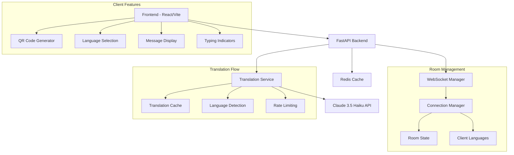

# Translation Chat Application

A real-time chat application with automatic translation powered by Claude 3.5 Haiku, built with FastAPI and React.

## 🌟 Features

- **Real-time messaging** with WebSocket connections
- **Automatic translation** to multiple languages using Claude 3.5 Haiku
- **QR code sharing** for easy room access
- **Multi-language support** (22+ languages)
- **Show original/translation toggle** for each message
- **Typing indicators** for enhanced user experience
- **Responsive design** with Tailwind CSS
- **Docker containerization** for easy deployment

## 🏗️ Architecture



## 🚀 Quick Start

### Prerequisites

- Docker and Docker Compose
- Anthropic API key for Claude 3.5 Haiku

### Setup

1. **Clone the repository**
   ```bash
   git clone <repository-url>
   cd Transalation_app
   ```

2. **Set up environment variables**
   ```bash
   cp .env.example .env
   # Edit .env and add your ANTHROPIC_API_KEY
   ```

3. **Start the application**
   ```bash
   docker compose up
   ```

4. **Access the application**
   - Frontend: http://localhost:3000
   - Backend API: http://localhost:8000
   - API Documentation: http://localhost:8000/docs

### Manual Setup (Development)

#### Backend Setup
```bash
cd backend
pip install -r requirements.txt
uvicorn main:app --reload
```

#### Frontend Setup
```bash
cd frontend
npm install
npm run dev
```

#### Redis Setup
```bash
docker run -d -p 6379:6379 redis:7-alpine
```

## 🎯 Usage

1. **Create a room** on the homepage
2. **Share the QR code** or room URL with others
3. **Select your language** when joining
4. **Start chatting** - messages are automatically translated for other users

## 🔧 Technical Details

### Backend Architecture

- **FastAPI** with WebSocket support
- **Connection Manager** tracks clients and their languages
- **Translation Service** with caching and timeout handling
- **Redis** for session management and caching

### Frontend Architecture

- **React 18** with hooks for state management
- **React Router** for navigation
- **WebSocket client** for real-time communication
- **Tailwind CSS** for styling
- **QR Code generation** for easy sharing

### Translation System

- **Claude 3.5 Haiku** for high-quality translations
- **In-memory caching** to reduce API calls
- **1.5-second timeout** for low latency
- **Fallback to original text** on errors

## 📊 Supported Languages

| Code | Language | Code | Language |
|------|----------|------|----------|
| en | English | es | Spanish |
| fr | French | de | German |
| it | Italian | pt | Portuguese |
| ru | Russian | ja | Japanese |
| ko | Korean | zh | Chinese |
| ar | Arabic | hi | Hindi |
| he | Hebrew | th | Thai |
| vi | Vietnamese | tr | Turkish |
| pl | Polish | nl | Dutch |
| sv | Swedish | da | Danish |
| no | Norwegian | fi | Finnish |

## 🔒 Security & Privacy

- **No message persistence** - messages exist only in memory
- **Rate limiting** planned for production use
- **CORS enabled** for development (configure for production)
- **Environment variables** for sensitive configuration

## 💰 Cost Considerations

- **Translation costs**: ~$0.25 per 1M input tokens (Claude 3.5 Haiku)
- **Caching reduces costs** by avoiding duplicate translations
- **Redis memory usage** scales with active connections

## ⚡ Performance

- **WebSocket connections** for real-time communication
- **Translation caching** for frequently used phrases
- **Timeout handling** prevents hanging requests
- **Connection pooling** for database efficiency

## 🚨 Known Limitations & Risks

| Risk | Mitigation |
|------|------------|
| Translation API failures | Fallback to original text |
| High translation costs | Aggressive caching, rate limiting |
| WebSocket connection drops | Auto-reconnection logic |
| Memory leaks in long sessions | Connection cleanup on disconnect |
| Translation quality issues | Show original text option |

## 🔮 Future Enhancements

- [ ] **Message persistence** with PostgreSQL
- [ ] **User authentication** and profiles
- [ ] **File sharing** with translation
- [ ] **Voice messages** with speech-to-text
- [ ] **Mobile app** with React Native
- [ ] **Advanced rate limiting** per user
- [ ] **Analytics dashboard** for usage metrics
- [ ] **Custom translation models** fine-tuning
- [ ] **Offline mode** with cached translations
- [ ] **End-to-end encryption** for privacy

## 📱 API Reference

### REST Endpoints

- `POST /rooms` - Create a new chat room
- `GET /health` - Health check endpoint

### WebSocket Endpoints

- `WS /ws/{room_id}` - Join a chat room
  - Query parameters: `client_id`, `language`, `username`

### Message Types

```json
{
  "type": "message",
  "text": "Hello world"
}

{
  "type": "typing",
  "is_typing": true
}
```

## 🛠️ Development

### Project Structure

```
├── backend/
│   ├── main.py              # FastAPI application
│   ├── requirements.txt     # Python dependencies
│   └── Dockerfile          # Backend container
├── frontend/
│   ├── src/
│   │   ├── components/     # React components
│   │   ├── App.jsx        # Main application
│   │   └── main.jsx       # Entry point
│   ├── package.json       # Node dependencies
│   └── Dockerfile         # Frontend container
├── services/
│   └── translation_service.py  # Translation logic
├── docker-compose.yml     # Container orchestration
└── README.md             # This file
```

### Testing

```bash
# Backend tests
cd backend
pytest

# Frontend tests
cd frontend
npm test
```

### Linting

```bash
# Backend
ruff check backend/

# Frontend
npm run lint
```

## 📈 Monitoring

- **Health check endpoint** at `/health`
- **WebSocket connection tracking** in logs
- **Translation success/failure rates** monitoring
- **Response time metrics** for API calls

## 🚀 Deployment

### Docker Compose (Recommended)

```bash
docker compose up -d
```

### Individual Services

```bash
# Backend
docker build -t translation-chat-backend ./backend
docker run -p 8000:8000 translation-chat-backend

# Frontend
docker build -t translation-chat-frontend ./frontend
docker run -p 3000:3000 translation-chat-frontend
```

### Environment Variables

| Variable | Description | Default |
|----------|-------------|---------|
| `ANTHROPIC_API_KEY` | Claude API key | Required |
| `REDIS_URL` | Redis connection string | `redis://localhost:6379` |
| `VITE_API_URL` | Backend API URL | `http://localhost:8000` |

## 📄 License

This project is licensed under the MIT License.

## 🤝 Contributing

1. Fork the repository
2. Create a feature branch
3. Make your changes
4. Add tests if applicable
5. Submit a pull request

## 📞 Support

For questions or issues, please open a GitHub issue or contact the development team.

---

*Built with ❤️ using FastAPI, React, and Claude 3.5 Haiku*